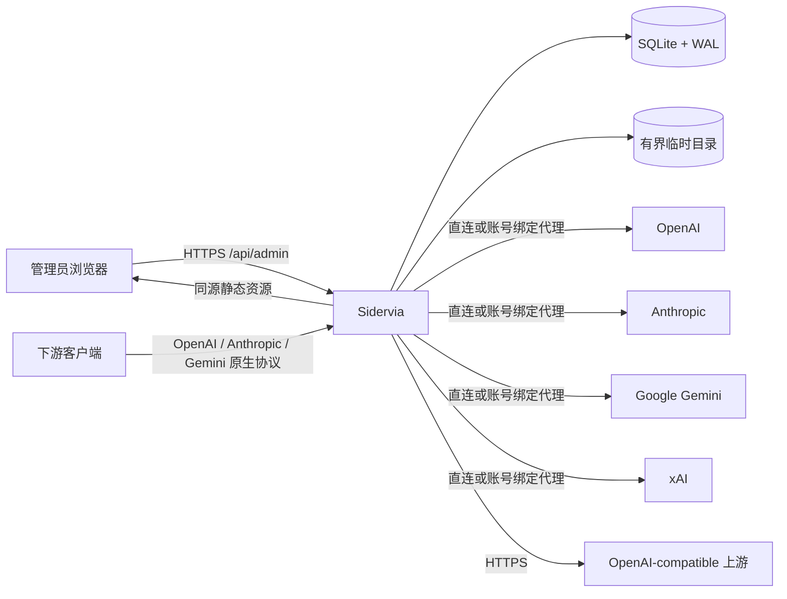
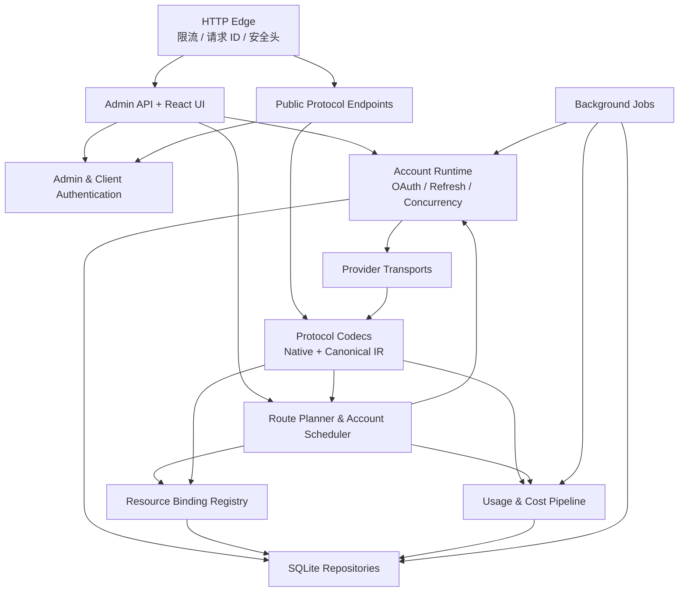
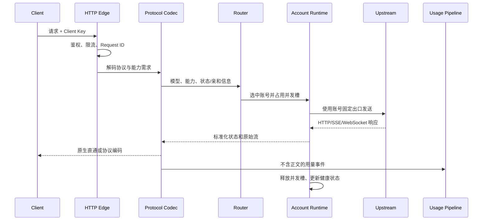
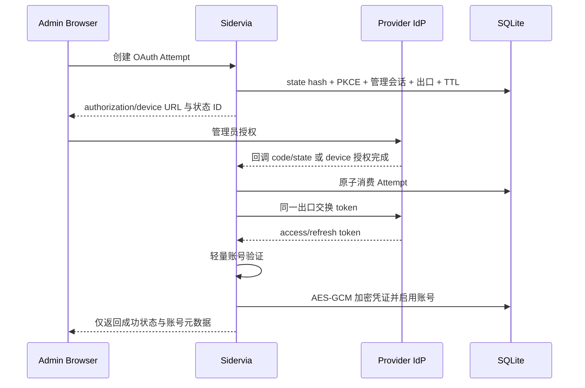
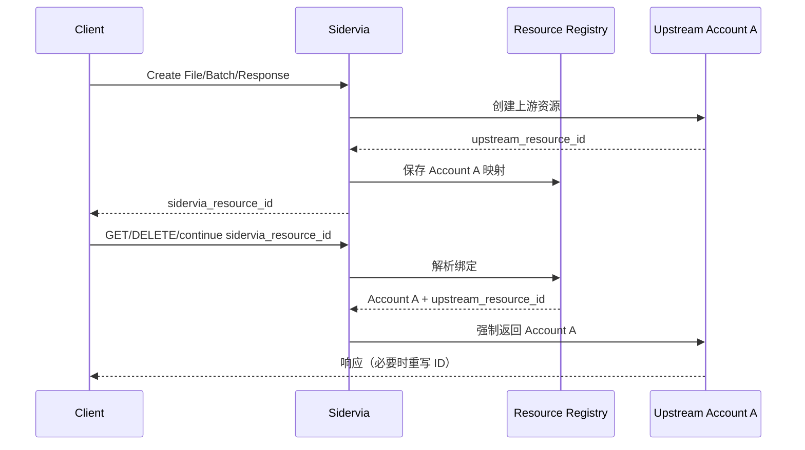
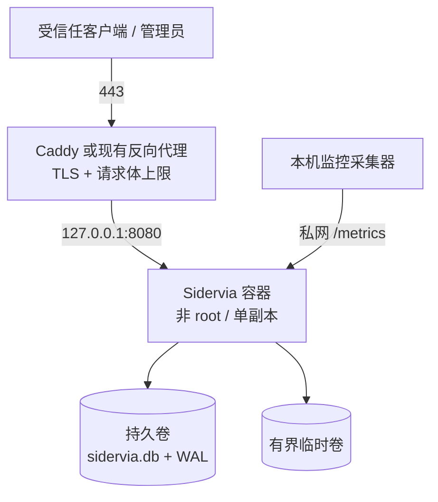

# Sidervia 总体架构

- 状态：实现基线
- 版本：0.1
- 日期：2026-07-16

## 1. 架构结论

Sidervia 采用单进程模块化单体：Go HTTP 服务负责公开 API、管理 API、认证、调度、协议适配、上游传输和后台任务；React 静态资源编译后嵌入同一个二进制；SQLite 保存控制平面、资源绑定、用量和审计数据。

这是针对单管理员、不超过 5 个下游用户的明确选择。v1 不部署 PostgreSQL、Redis、消息队列或独立前端服务。

## 2. 系统上下文

信任边界：

1. 浏览器与管理 API 之间是管理员边界。
2. 下游客户端与公开 API 之间是 Client Key 边界。
3. Sidervia 与各上游/代理之间是外部网络边界。
4. 进程内明文凭证与 SQLite 加密凭证之间是密钥边界。
5. 持久数据与临时媒体目录之间是数据生命周期边界。

## 3. 逻辑组件

### 3.1 HTTP Edge

统一负责：

- TLS 终止后的可信代理判断、真实来源地址和 Request ID。
- 管理端和公开端的路由隔离。
- Header/URL/Body 大小限制、超时、并发和取消传播。
- 管理会话、Client Key、CSRF、CORS 和安全响应头。
- 结构化访问日志；在进入日志前完成敏感字段清除。

Edge 不解析具体 Provider 业务语义，避免在通用中间件中引入协议分支。

### 3.2 Admin API 与 Web UI

Admin API 使用 `/api/admin/v1` 版本前缀，React UI 只调用同源接口。UI 不持有上游凭证，OAuth 回调只展示流程状态。

管理写操作进入领域服务并写审计事件，不允许 UI 绕过领域校验直接更新数据库。

### 3.3 Public Protocol Endpoints

公开端按协议家族组织：

- OpenAI-compatible：Responses、Chat Completions 及各原生资源接口。
- Anthropic：Messages、Token Counting、Message Batches、Files 等。
- Gemini：GenerateContent、流式生成、Embeddings、Files、Batch 和 Live 等原生接口。
- xAI：官方支持的 OpenAI-compatible 和 xAI 原生媒体/批处理接口。

接口是否开放由 Provider 能力声明和 Model Route 同时决定。仅配置模型名不能自动获得未验证能力。

### 3.4 Protocol Codecs

协议层分成两条明确路径：

1. **Native path**：保持原协议结构；响应侧安全保留 Provider 新字段/事件，请求侧按版本化字段策略转发，仅做必要的模型/资源 ID 映射、用量观察和安全过滤。
2. **Converted path**：请求先解码为带版本的 Canonical IR，再由目标 Provider 编码。只有共有语义进入 IR。

两条路径不得共享一个不断增长的万能 DTO。Native path 以原始 JSON/事件加版本化字段策略为主，Converted path 使用强类型 IR。未知请求字段不会为了“兼容”而直接送到官方 Provider；未知响应字段也不会因为本地 Schema 尚未认识就静默消失。

### 3.5 Route Planner 与 Account Scheduler

Route Planner 把 `公开协议 + 公开模型 + 所需能力` 解析成候选集合。Account Scheduler 在集合内执行硬过滤、资源绑定、软亲和、优先级和负载选择。

调度决策生成内部解释记录，包含候选数量和标准化原因码；解释记录不包含凭证、完整请求字段或上游响应正文。

### 3.6 Account Runtime

每个账号具有独立运行时对象：

- 凭证快照和到期时间。
- per-account singleflight 刷新控制。
- 有界并发信号量。
- 失败计数、官方 quota/reset 信号和冷却期限。
- 与账号绑定的出站 `http.Client`/WebSocket dialer。

热路径只读取不可变快照。刷新或管理变更成功后原子替换快照，避免请求持有数据库锁。

### 3.7 Provider Transport

Transport 只负责上游网络行为和 Provider 特有操作：

- 构建目标 URL 和安全 Header。
- API Key/OAuth/WIF 等授权注入。
- HTTP、SSE、WebSocket 和流式媒体传输。
- 官方错误、限流和 quota 信号标准化。
- 认证验证、token refresh 和模型发现。

每个账号的登录、刷新、探测和推理复用同一 Egress Profile，防止身份建立与实际调用来自不同出口。

### 3.8 Resource Binding Registry

Registry 是强状态请求的唯一寻址来源。它将 Sidervia 资源 ID 映射到 Provider、Upstream、Account 和 upstream resource ID，并负责 JSON/SSE 中的必要 ID 重写。

Registry 的存在优先于普通调度：一旦请求包含已知强状态 ID，就不能选择其他账号。

### 3.9 Usage & Cost Pipeline

请求结束或流关闭后，热路径把固定大小的 Usage Event 写入有界内存队列；后台批量短事务写入 SQLite。队列满时采用同步降级写入而不是静默丢弃。

Cost Engine 使用请求结束时有效的价格目录版本生成 line items。聚合任务按 UTC 日/月增量更新，原始明细到期后删除，聚合不删除。

### 3.10 Background Jobs

单进程后台任务包括：

- OAuthAttempt、管理会话和资源绑定的到期清理。
- OAuth 凭证提前刷新及需要重新认证检测。
- 临时文件和异常残留清理。
- 用量批次落库与日/月聚合。
- 365 天请求明细保留策略。
- SQLite checkpoint、维护提醒和健康探测。

任务使用数据库租约或进程内互斥避免同一任务重入；v1 不设计分布式选主。

## 4. 核心数据流

### 4.1 普通推理请求

重试只能发生在下游响应尚未提交时。流一旦开始，任何错误都在当前流中按协议结束。

### 4.2 OAuth 添加账号

固定 localhost 回调无法直达 VPS 时，允许管理员手工粘贴完整回调 URL 作为后备。服务端仍必须验证 state、PKCE、TTL 和管理会话，前端不得解析 token。

### 4.3 强状态资源

## 5. 进程与并发模型

- 一个 OS 进程、一个 SQLite writer 协调层、多个短生命周期请求 goroutine。
- 每个账号一个有界信号量；全局还有公开 API、管理 API、OAuth 和媒体临时文件独立上限。
- Provider 配置和路由表编译成不可变内存快照，通过原子指针替换。
- 数据库写入分为控制面同步事务和用量异步批事务。控制面写入不能排队到用量通道。
- 每个出站请求都有明确的连接、首包、空闲流和总生命周期限制；Realtime/WebSocket 使用独立策略。
- 下游取消立即取消上游 context，并在 `defer` 中释放并发槽和临时资源。

## 6. 存储架构

SQLite 保存四类数据：

1. **控制面**：管理员、Client Key、Upstream、Proxy、Account、Model Route 和设置。
2. **状态面**：账号冷却、OAuthAttempt、资源绑定和任务租约。
3. **观测面**：请求明细、用量 line items、聚合和审计事件。
4. **版本面**：Schema migration、Provider capability snapshot 和价格目录。

数据库开启 WAL、foreign keys 和 busy timeout。所有时间以 UTC 存储。大对象、请求正文和媒体不进入 SQLite。

详细表结构见[详细设计](detailed-design.md#8-数据模型)。

## 7. 网络与代理架构

Egress Profile 由 `direct` 或一个 HTTP/HTTPS/SOCKS5 Proxy 构成。账号级配置覆盖 Upstream 默认配置。

每个 profile 构建独立连接池，禁止不同代理身份共享连接。DNS 解析、私网校验、代理认证和 TLS 设置均属于 profile，不允许请求参数动态指定代理。

下游传来的以下内容不会转发：

- `Authorization`、`Proxy-Authorization`、Cookie 和管理会话头。
- `Connection`、`Keep-Alive`、`Transfer-Encoding`、`Upgrade` 等逐跳头；合法 WebSocket upgrade 由专用处理器重建。
- `Host`、`Forwarded`、`X-Forwarded-*` 和未经允许的追踪身份头。
- Sidervia 私有路由/诊断头。

## 8. 部署拓扑

只允许一个容器挂载并使用数据卷。SQLite 文件不得放在 NFS/SMB 等共享网络文件系统上。

## 9. 架构决策记录

| 决策 | 选择 | 原因 |
| --- | --- | --- |
| 后端语言 | Go 1.26 | 网络并发、部署简单、单二进制、生态成熟 |
| 前端 | React + TypeScript + Vite | 管理页面生态成熟，构建产物易嵌入 |
| 数据库 | SQLite WAL | 单机小用户规模足够，减少运维组件 |
| 缓存/锁 | 进程内 | 不需要 Redis；singleflight、信号量和原子快照足够 |
| Provider 扩展 | 编译期适配器 | 更易审计，避免动态代码和过早插件系统 |
| 协议策略 | 原生直通 + 共有 IR | 避免把不等价能力强行转换 |
| 媒体 | 流式，不归档 | 降低隐私风险和 40 GiB 磁盘压力 |
| 管理权限 | 单管理员 | 符合目标场景，避免提前实现 SaaS/RBAC |
| 账号选择 | 过滤 + 优先级 + 负载率 + 轮转 | 简单、确定、可解释，适合单机 |
| 发布方式 | 预构建容器 + 单二进制 | VPS 不承担 Node/Go 构建成本 |

## 10. 演进边界

只有在真实运行数据证明以下需求存在时，才允许引入对应复杂度：

- 多节点一致性：重新评估 PostgreSQL/Redis，而不是共享 SQLite。
- 更复杂调度：先采集并验证错误率、TTFT 和 quota 数据，再考虑 EWMA/top-K。
- 外部 Provider：先稳定内部接口和兼容测试，再设计受限插件 SDK。
- 长期媒体：使用独立对象存储和生命周期策略，不扩张 SQLite 或本地卷。

路线图见[版本计划](roadmap.md)。
